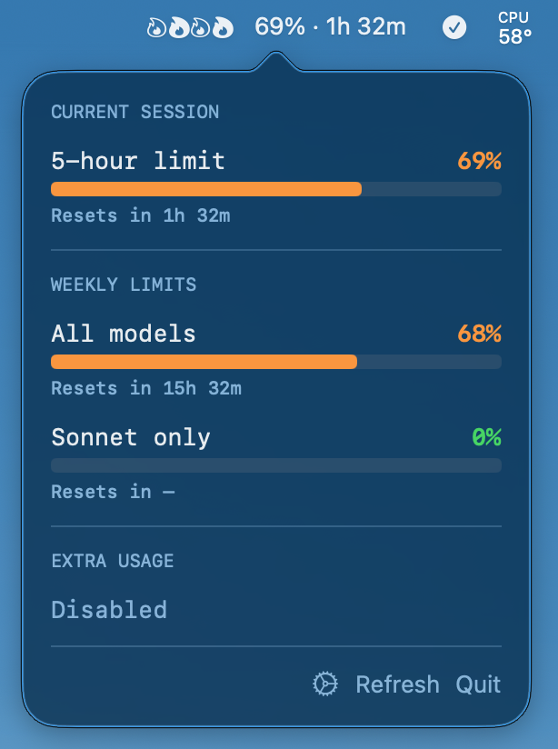

[English](README.md)

# Claude Peak

Claude Max 구독의 usage limit을 실시간으로 모니터링하는 macOS 메뉴바 앱.

## Screenshots

<p align="center">
  
</p>

메뉴바에 현재 5-hour 사용률(%)과 reset 남은 시간이 표시되며, 클릭하면 상세 사용량을 확인할 수 있다.
토큰을 사용 중이면 불꽃 아이콘이 활동량에 따라 애니메이션된다.

## 기능

- **메뉴바 표시**: 5-hour utilization %, reset 남은 시간 (설정에서 변경 가능)
- **실시간 불꽃 애니메이션**: `~/.claude/projects/` JSONL 로그를 감시하여 토큰 활동량에 따라 불꽃이 타오름
- **상세 Popover**: 5-hour, 7-day(All models), 7-day(Sonnet) 사용량 + reset 타이머
- **설정**: 메뉴바 표시 형식 (% only / time only / both), 갱신 주기 (1분/5분/10분)
- **자동 갱신**: 설정 가능한 폴링 간격 (기본 5분)
- **OAuth 인증**: 브라우저 기반 PKCE 인증, refresh token 자동 갱신

## 기술 스택

- Swift + SwiftUI
- SPM (Swift Package Manager)
- macOS 13+ (`NSStatusItem` + `NSPopover`)
- OAuth 2.0 PKCE (로컬 HTTP 서버로 callback 수신)

## 프로젝트 구조

```
claude-usage-limit/
├── Package.swift
├── Sources/
│   ├── App.swift              # @main, NSStatusItem + NSPopover + 불꽃 렌더링
│   ├── UsageView.swift        # popover UI + 설정 화면
│   ├── UsageService.swift     # Usage API 호출 + 토큰 관리
│   ├── OAuthService.swift     # OAuth PKCE 플로우 (브라우저 인증)
│   ├── KeychainHelper.swift   # 토큰 파일 저장/읽기 (~/.config/claude-peak/tokens.json)
│   ├── Settings.swift         # 앱 설정 (UserDefaults 저장)
│   ├── ActivityMonitor.swift  # JSONL 로그 감시 → 실시간 토큰 활동량 계산
│   └── Models.swift           # UsageResponse 등 API 모델
├── Formula/
│   └── claude-peak.rb         # Homebrew formula
├── Resources/
│   └── Info.plist             # LSUIElement = true (Dock 숨김)
└── build.sh                   # .app 번들 빌드 + ~/Applications 설치
```

## 설치

### Homebrew (추천)

```bash
brew tap letsur-dev/claude-peak https://github.com/letsur-dev/claude-peak.git
brew install claude-peak

# 실행 (첫 실행 시 ~/Applications에 자동 링크)
claude-peak
```

### 소스에서 빌드

```bash
git clone https://github.com/letsur-dev/claude-peak.git
cd claude-peak
./build.sh

# 실행
open ~/Applications/Claude\ Peak.app
```

## 인증

첫 실행 시 "Login with Claude" 버튼 → 브라우저에서 Claude 계정 로그인 → 자동 토큰 저장.

### 인증 플로우

1. 앱이 로컬 HTTP 서버 시작 (랜덤 포트, IPv6)
2. 브라우저로 `claude.ai/oauth/authorize` 열기 (PKCE code_challenge 포함)
3. 사용자 인증 후 `http://localhost:PORT/callback?code=xxx`로 리다이렉트
4. 앱이 code를 받아 `platform.claude.com/v1/oauth/token`에서 토큰 교환
5. `~/.config/claude-peak/tokens.json`에 저장 (0600 권한)

### 토큰 갱신

- access token 만료 5분 전 자동 refresh
- refresh 실패 시 재로그인 안내

## 불꽃 애니메이션

`~/.claude/projects/**/*.jsonl` 파일을 2초마다 스캔하여 최근 30초간 토큰 처리량(tokens/sec)을 계산한다.

| 활동량 | 불꽃 | 애니메이션 속도 |
|--------|------|----------------|
| 0 tps | 🔥 (작은 불씨, 정적) | 없음 |
| > 0 tps | 🔥 × 1 | 0.5초 |
| > 100 tps | 🔥 × 2 | 0.35초 |
| > 500 tps | 🔥 × 3 | 0.2초 |
| > 1000 tps | 🔥 × 4 | 0.12초 |

## API

### Usage 조회

```
GET https://api.anthropic.com/api/oauth/usage
Headers:
  Authorization: Bearer {access_token}
  anthropic-beta: oauth-2025-04-20
  User-Agent: claude-code/2.0.32
```

응답 예시:

```json
{
  "five_hour": { "utilization": 2.0, "resets_at": "2026-01-29T09:59:59Z" },
  "seven_day": { "utilization": 63.0, "resets_at": "2026-01-29T23:59:59Z" },
  "seven_day_sonnet": { "utilization": 0.0, "resets_at": null },
  "extra_usage": { "is_enabled": false }
}
```

- `utilization`: 0~100 (퍼센트)
- `resets_at`: ISO 8601 타임스탬프 또는 null

### Token Refresh

```
POST https://platform.claude.com/v1/oauth/token
Content-Type: application/json

{
  "grant_type": "refresh_token",
  "refresh_token": "...",
  "client_id": "9d1c250a-e61b-44d9-88ed-5944d1962f5e",
  "scope": "user:profile user:inference"
}
```

## 개발 과정에서 발견한 것들

- **Keychain 토큰 만료 문제**: Claude Code는 매 세션마다 브라우저 OAuth로 재인증하며, Keychain의 refresh token이 무효화될 수 있다. 따라서 앱 자체 OAuth 플로우가 필요.
- **`claude setup-token`의 한계**: inference-only 토큰(`user:inference` scope만)을 발급하므로 usage API(`user:profile` 필요)에 사용 불가.
- **OAuth redirect URI**: 반드시 `http://localhost:PORT/callback` 형식이어야 함. `127.0.0.1`이나 `/oauth/callback` 경로는 거부됨.
- **IPv6**: macOS에서 `localhost`는 `::1`(IPv6)로 해석될 수 있으므로 IPv6 소켓 필요.
- **Token exchange**: `state` 파라미터가 authorize와 token exchange 양쪽에 필요.
- **utilization 값**: API 응답의 utilization은 0~100 정수 (0~1 소수가 아님).
- **필드명**: API 응답은 `resets_at` (복수형 s).
- **JSONL 토큰 로그**: Claude Code는 `~/.claude/projects/` 아래에 세션별 JSONL 파일을 생성하며, 각 라인의 `message.usage`에 토큰 사용량이 기록됨.
